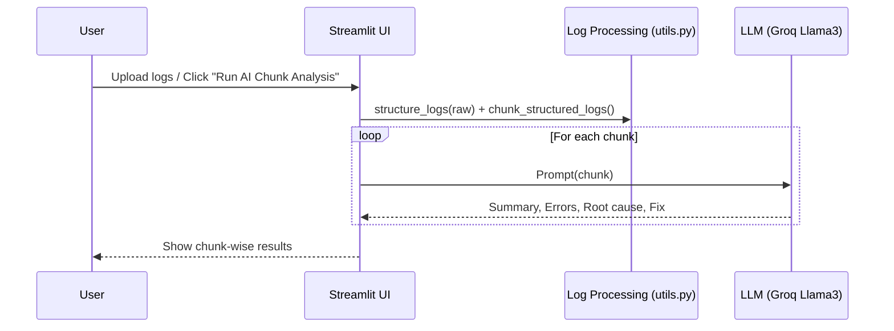
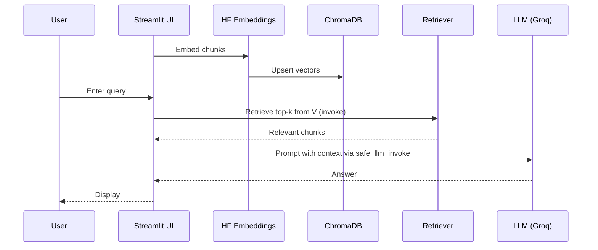

# LogMentor RAG – Architecture Diagrams

This document contains Mermaid diagrams for the system architecture, block view, and key sequences.

Note: To render Mermaid in VS Code, use the “Markdown Preview Mermaid Support” extension or open on a platform that supports Mermaid.

---

## 1) System Architecture

```mermaid
flowchart LR
  U[User] -->|Upload logs / Ask| UI[Streamlit UI (app.py)]

  UI -->|parse, normalize| LP[Log Processing (utils.py)]
  LP --> CH[Chunking]
  CH --> DOCS[LangChain Documents]

  DOCS -->|embed| EMB[HuggingFace Embeddings\n(paraphrase-MiniLM-L3-v2)]
  EMB -->|vectors| VS[(ChromaDB / SQLite)]

  %% Chunk analysis path
  UI -->|Run Analysis| LLM[Groq Llama3-70B (ChatGroq)]
  CH -. text chunks .-> LLM
  LLM -->|per-chunk insights| UI

  %% RAG Q&A path
  UI -->|Ask| RET[Retriever]
  VS --> RET
  RET -->|relevant chunks| LLM
  LLM -->|answer| UI
```

---

## 2) Block Diagram (Component View)

```mermaid
flowchart TB
  U[User] --> UI[Streamlit UI (app.py)]

  subgraph Ingestion & Prep
    LP[Log Processing (utils.py)\nstructure_logs + chunk_structured_logs]
  end

  subgraph Vector Pipeline
    EMB[HuggingFace Embeddings\n(paraphrase-MiniLM-L3-v2)]
    VS[(ChromaDB / SQLite)]
  end

  subgraph LLM Services
    LLM[Groq Llama3-70B\n(ChatGroq)]
  end

  UI --> LP --> DOCS[Chunks as Documents]
  DOCS --> EMB --> VS

  %% Chunk Analysis path
  DOCS -. text chunks .-> LLM
  LLM -->|Chunk insights| UI

  %% RAG Q&A path
  UI -->|Query| VS
  VS -->|Retrieve top-k chunks| UI
  UI -->|Prompt with context| LLM
  LLM -->|Answer| UI
```

---

## 3) Sequence – Chunk Analysis



---

## 4) Sequence – RAG Q&A


