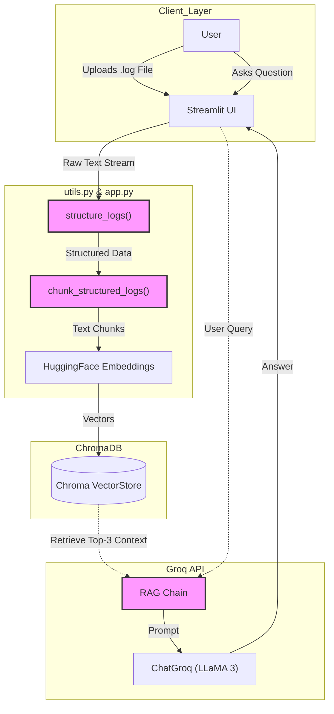
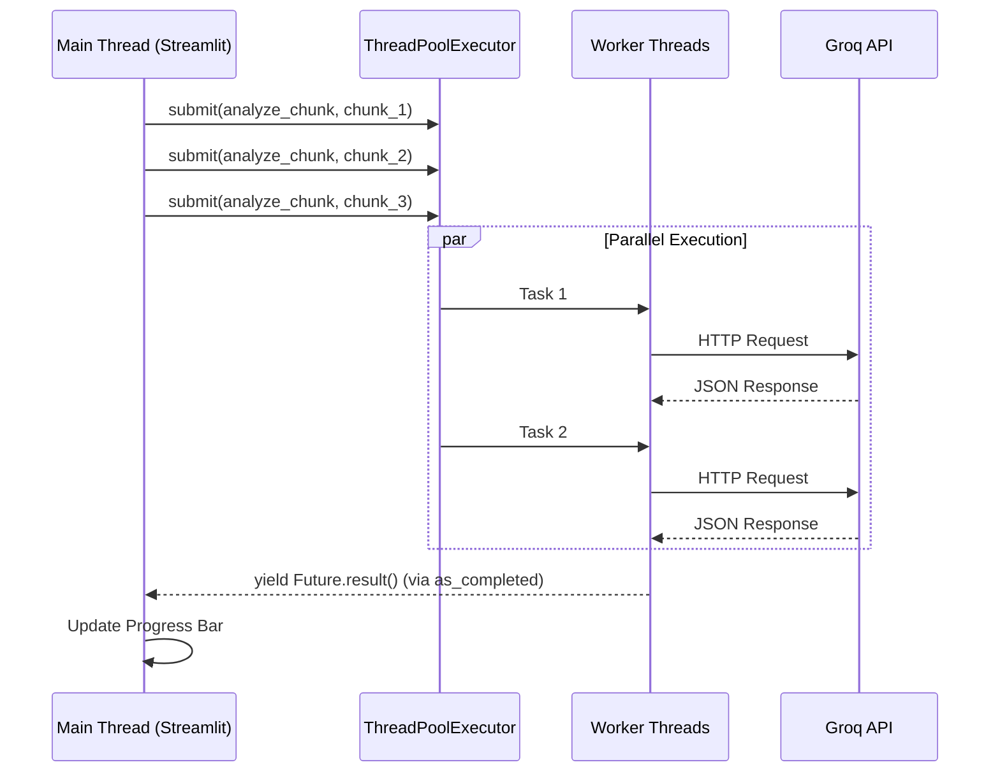
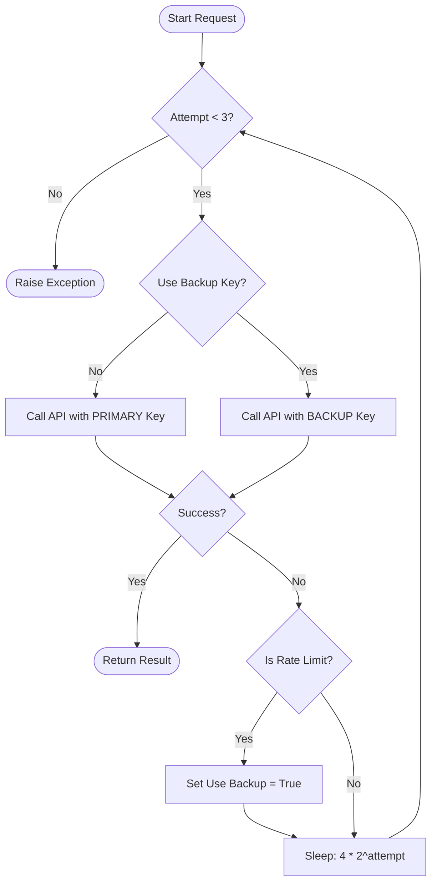
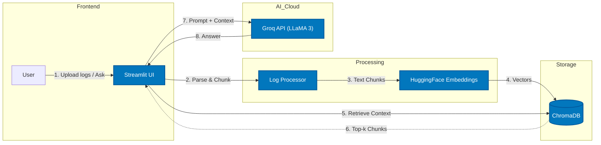

Here are the **4 Architecture Diagrams** derived strictly from your codebase (`app.py` and `utils.py`). You can draw these on a whiteboard or use the Mermaid code provided to generate them digitally.

### **1. The RAG Data Pipeline (ETL & Inference)**

*This diagram visualizes the end-to-end flow implemented in `app.py`, from file upload to the final answer.*

---

### **2. The Sliding Window Algorithm (Memory Model)**

*This visualizes the `chunk_structured_logs` function in `utils.py`. It is critical for explaining how you prevent context loss.*

```mermaid
gantt
    title Sliding Window Chunking (Overlap = 10)
    dateFormat X
    axisFormat %s
    
    section Log Stream
    Log Entries 0-200    :0, 200
    
    section Chunk 1
    Logs 0 to 100        :active, 0, 100
    
    section Chunk 2
    Overlap (90-100)     :crit, 90, 100
    Logs 100 to 190      :active, 100, 190
    
    section Chunk 3
    Overlap (180-190)    :crit, 180, 190
    Logs 190 to 200      :active, 190, 200

```

*Note for Interview:* Point to the red/critical sections and say: *"This overlap ensures that if an error stack trace starts at line 95 and ends at 105, it is fully captured in Chunk 2."*

---

### **3. The ThreadPool Execution Model (Concurrency)**

*This visualizes the `analyze_chunks_parallel` function in `app.py`. It shows how you process multiple chunks without blocking.*

---

### **4. The Fault-Tolerant Retry Logic (Control Flow)**

*This visualizes the `safe_llm_invoke` function in `app.py`. It proves your code is production-ready.*

### **5. High-Level System Architecture**

